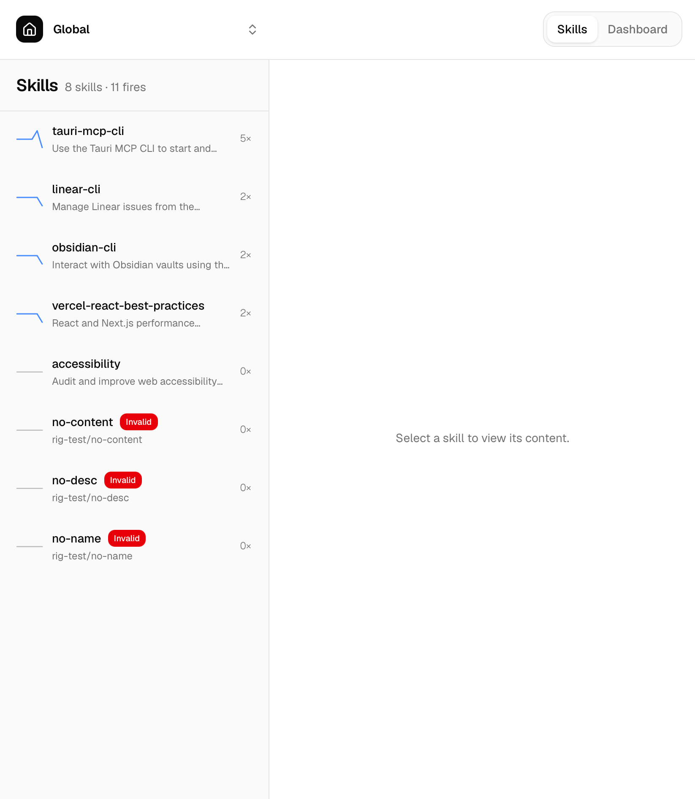

# Rig

Rig is a local-first desktop app for organizing scattered agent SKILL files before they become a mess.

Browse every local skill from one place, edit files without jumping between folders, and track which skills are actually being used.



## Why Rig?

Agent SKILL files are powerful, but they are easy to lose track of once they spread across projects, config folders, and local experiments.

Rig gives you one focused desktop workspace for finding, editing, and understanding the skills already living on your machine.

## Features

- **Browse local SKILL files**
  Discover and inspect SKILL files from one place.
- **Edit skills directly**
  Update SKILL files in place without switching between folders and editors.
- **Track skill usage**
  See invocation counts and understand which skills are actually being used.

## Quick Start

### 1. Install Rig

1. Download the latest macOS app from the [Rig releases page](https://github.com/builder-mafia/rig/releases).
2. Open the downloaded `.dmg` file.
3. Drag Rig into Applications.
4. Launch Rig.

### 2. Install Plugins

#### OpenCode

Add `rig-opencode` to your OpenCode config. The config file is usually at `~/.config/opencode/opencode.json`.

```json
{
  "$schema": "https://opencode.ai/config.json",
  "plugin": ["rig-opencode"]
}
```

Restart OpenCode after saving the config. OpenCode installs npm plugins automatically at startup.

#### Claude Code

Add the Rig Claude Code marketplace and install the plugin:

```sh
# Add the Rig marketplace
/plugin marketplace add builder-mafia/rig

# Install the Rig Claude Code plugin
/plugin install rig-claude-code@rig

# Reload the plugins
/reload-plugins
```


## License

See [LICENSE](LICENSE).
